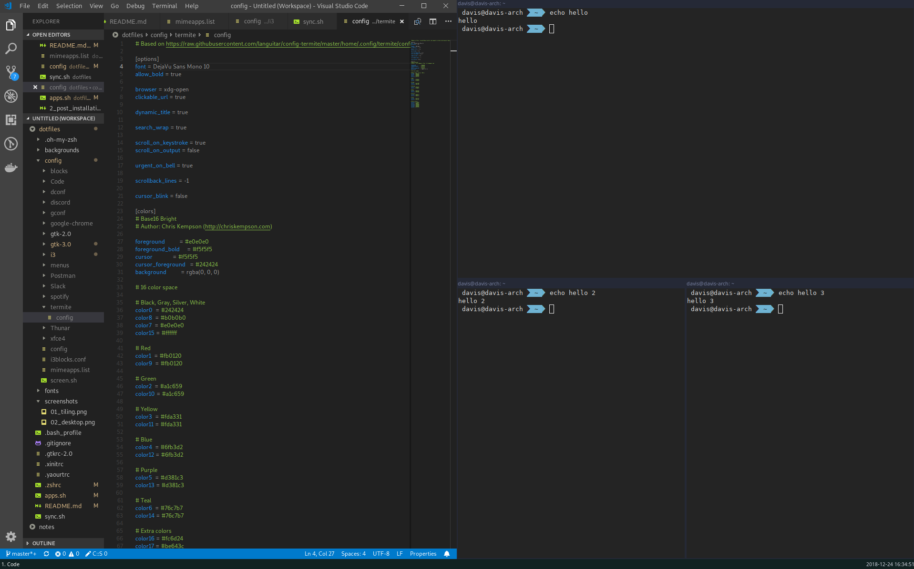

# Learning Arch linux, dotfiles

most things taken from [https://github.com/bookercodes/setupi3](https://github.com/bookercodes/setupi3)

# Screenshots

# TODO:

- [x] Sound
- [x] i3
- [x] i3 bar
- [x] i3 colors
- [x] Spotify + media keys
- [x] Assign apps to workspaces
- [x] Background
- [x] Fonts
- [x] Appearance
- [x] File explorer
- [x] F.lux / Redshift
- [x] Keyboard bind enable/disable redshift
- [x] Lock screen
- [x] new terminal
- [x] zsh + fonts-powerline
- [x] wine + heidisql
- [ ] docker + docker-compose
- [x] postman
- [x] slack
- [x] discord
- [x] telegram
- [x] shutter
- [x] Latvian keyboard layout

Issues:

- Wine floating apps (heidisql), when focus out - cannot click.

