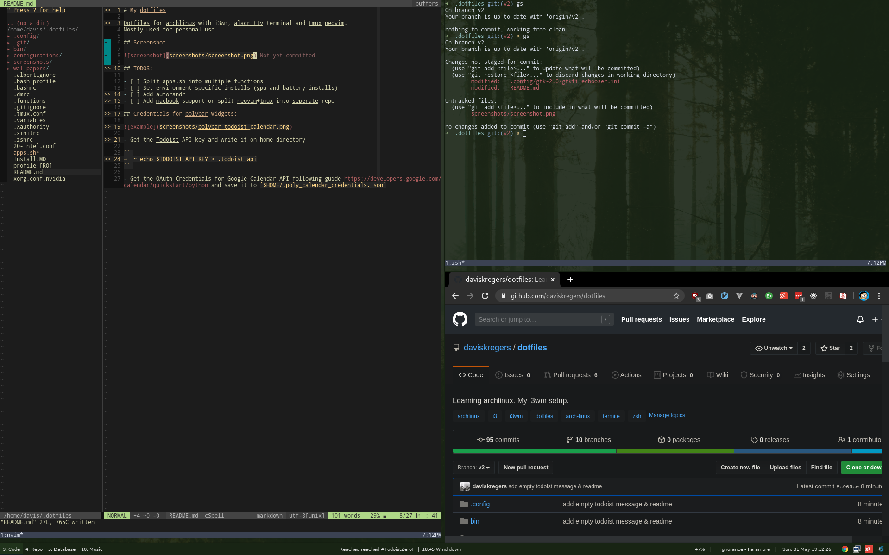
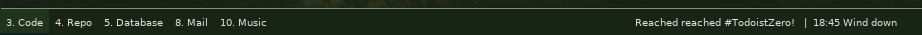

# My dotfiles

Dotfiles for archlinux with i3wm, alacritty terminal and tmux+neovim.
Mostly used for personal use.

## Screenshot



## TODOS:

- [ ] Split apps.sh into multiple functions
- [ ] Set environment specific installs (gpu and battery installs)
- [ ] Add autorandr
- [ ] Add macbook support or split neovim+tmux into seperate repo

## Credentials for polybar widgets:



- Get the Todoist API key and write it on home directory

```
➜  ~ echo $TODOIST_API_KEY > .todoist_api
```

- Get the OAuth Credentials for Google Calendar API following guide https://developers.google.com/calendar/quickstart/python and save it to `$HOME/.poly_calendar_credentials.json`
