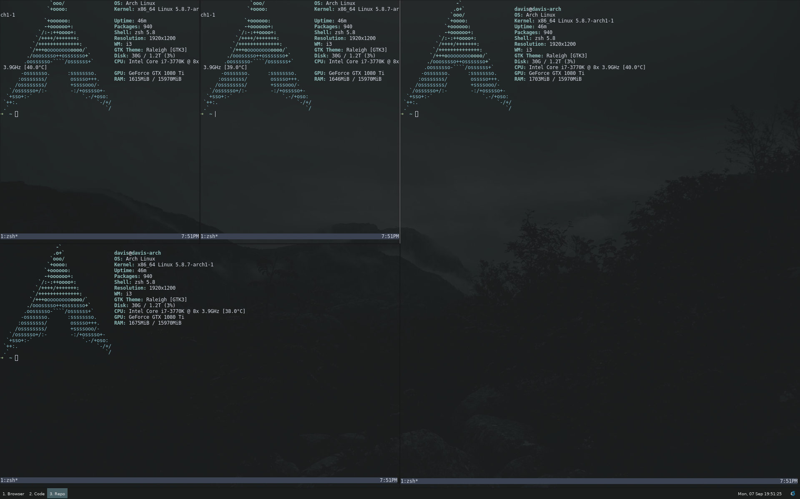

# Dotfiles

These dotfiles are being written for my archlinux and OSX setup.




## Installation on arch

Make an installation usb, boot it. When the terminal appears, do this:

```
pacman -Sy git
git clone https://github.com/daviskregers/dotfiles.git
...
Create a device with 3 partitions - EFI (256M), BOOT (512M), SYSTEM
...
./install-arch.sh
... follow instructions for installing arch, once finished run
arch-chroot /mnt
cd root/dotfiles
./configure-arch.sh
exit
reboot
... log into your new user
cd .dotfiles
./configure-user.sh
reboot
```

# Useful to remember

The setup script uses grub which currently will not work with nvme devices.
To fix that we'll need to use systemd bootloader.

```
pacman -S efibootmgr
vim /etc/mkinitcpio.conf
> HOOKS="systemd keymap sd-encrypt base udev autodetect modconf block encrypt filesystems keyboard fsck"

mkinitcpio -P
systemd-machine-id-setup
bootctl --path=/boot install

uuid=$(blkid --match-tag UUID -o value /dev/nvme0n1p2)
cat <<EOF >/boot/loader/entries/arch.conf
title   Arch Linux
linux   /vmlinuz-linux
initrd  /initramfs-linux.img
options cryptdevice=UUID=${uuid}:system root=/dev/mapper/system
EOF

# cat <<EOF >/boot/loader/loader.conf
default arch
timeout 3
EOF
```

